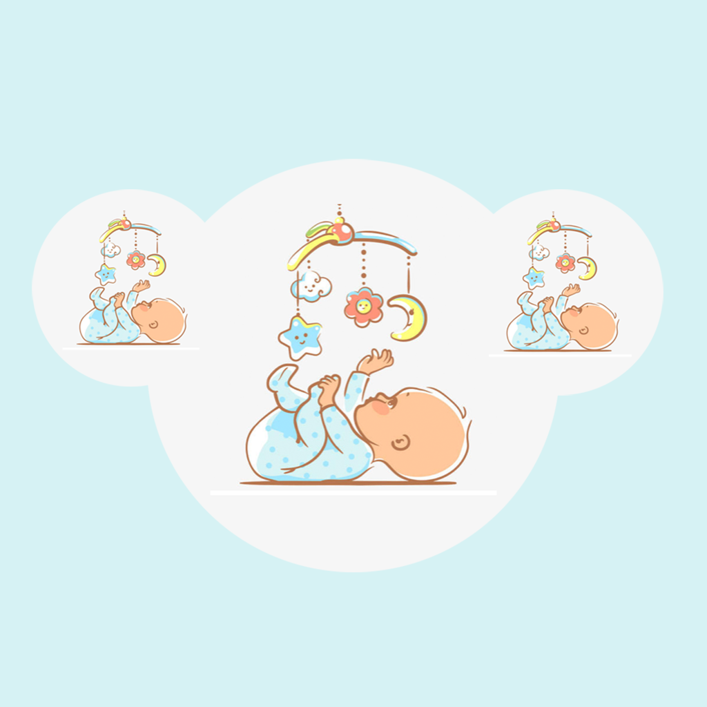

## Welcome to My Baby Owned Toys Record Tool

Does your baby have a lot of toys, too? All kinds of toys, but you don't know which one is the baby's favorite toy. This app can help you understand how much your baby likes toys and what kind of toys they are. You can keep track of the kinds of toys your baby already has and the size of the toys. You can also record your baby's movements as he plays with each toy, whether he is happy, and whether the toy is too big or too small. You can collect your baby's favorite toys, play with your baby and let him grow up happily.

If you have any questions, you can either leave a message or send the questions to our email address.

We will answer them for you in the first time.

### Address: jichungan9498@163.com

Thank you!
